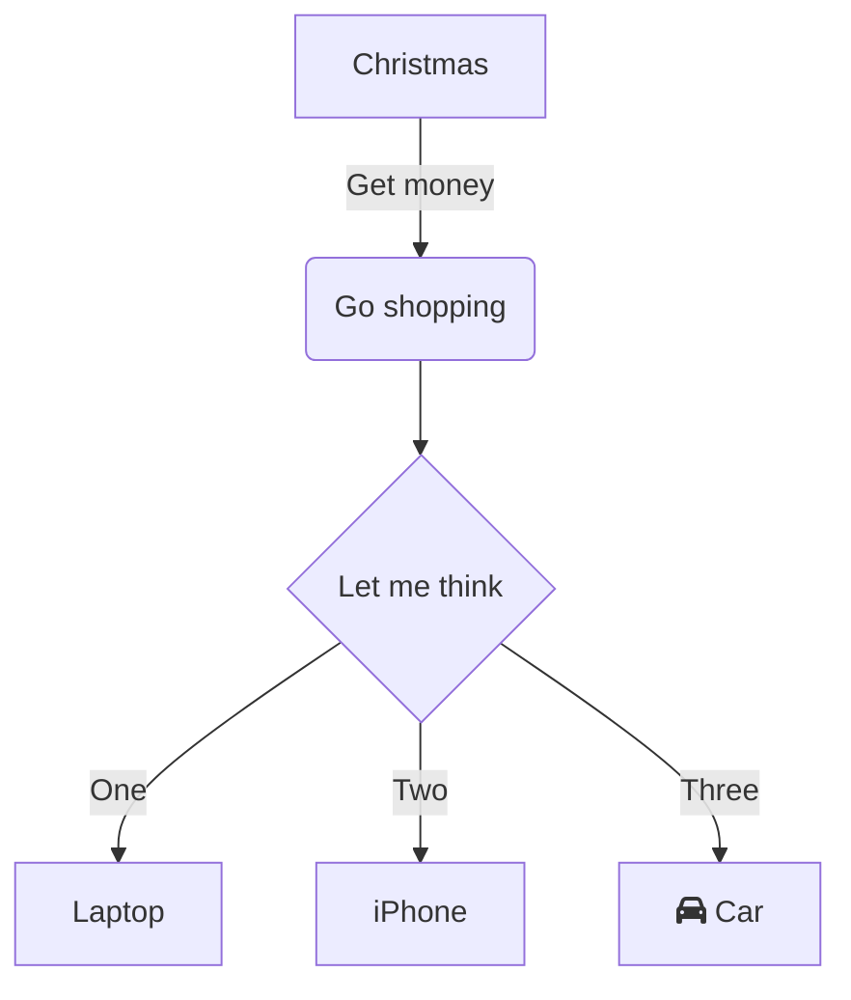
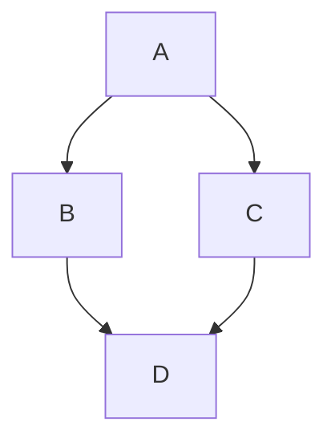

## Привет, Мир!






```mermaid
sequenceDiagram
   autonumber
   Alice->>John: Hello John, how are you?
   loop Healthcheck
       John->>John: Fight against hypochondria
   end
   Note right of John: Rational thoughts!
   John-->>Alice: Great!
   John->>Bob: How about you?
   Bob-->>John: Jolly good!
   ```

   ```mermaid
   railroad-beta
    title JSON Grammar

    json = nonterminal("element") ;
    element = choice(nonterminal("object"), nonterminal("array"), nonterminal("string"), nonterminal("number"), terminal("true"), terminal("false"), terminal("null")) ;
    object = sequence(terminal("{"), optional(sequence(nonterminal("member"), zeroOrMore(sequence(terminal(","), nonterminal("member"))))), terminal("}")) ;
    array = sequence(terminal("["), optional(sequence(nonterminal("element"), zeroOrMore(sequence(terminal(","), nonterminal("element"))))), terminal("]")) ;
    member = sequence(nonterminal("string"), terminal(":"), nonterminal("element")) ;
   ```

```plantuml
@startuml

actor "Front" as front

participant "Сервис справок" as report
database "База данных" as db

front -> report: Получение список справок
activate report
report -> db:  Получение список справок из бд
activate db
db --> report:  Список справок
deactivate db
report -> front: Список справок
deactivate report

@enduml
```